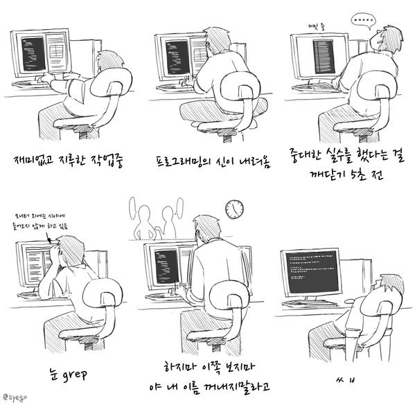

# 한림대학교 소프트웨어융합대학
---

평소 과제할때 모습

---

소속 : 소프트웨어 융합대학
전공 : 콘텐츠IOT전공

관심분야
*생물정보학
*인공지능
*의료정보학

프로그래밍 언어 스킬
1.C
2.JAVA
3.Python

--------------------

2020년도 1학기 수강 과목
|과목|내용|학점|
|---|---|---|
|C 프로그래밍|C언어 개요|3|
|JAVA 프로그래밍|JAVA 개요|3|
|소프트웨어세미나1|최신소프트웨어 트렌드|1|

github address: [zkfks4545][github]

[github]:http://github.com/zkfks4545
